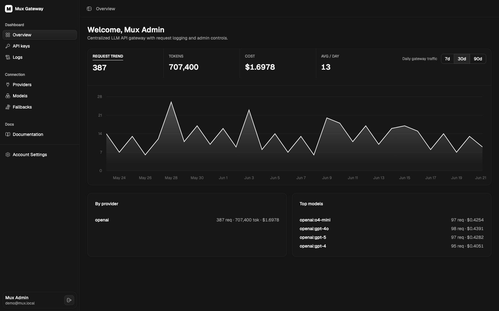
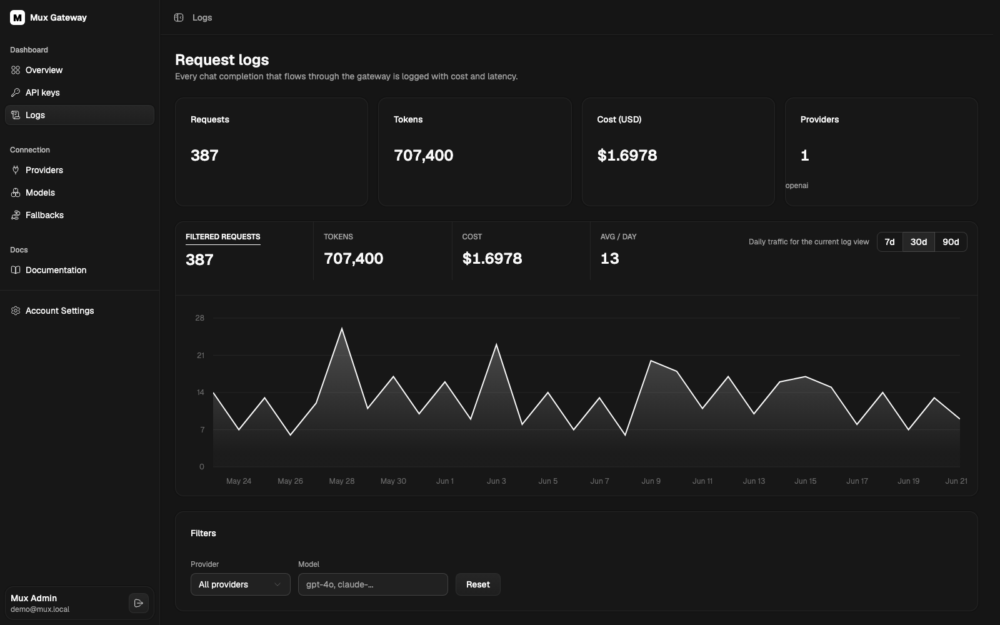
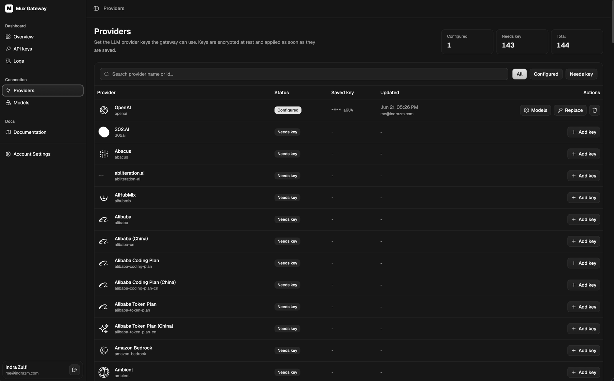
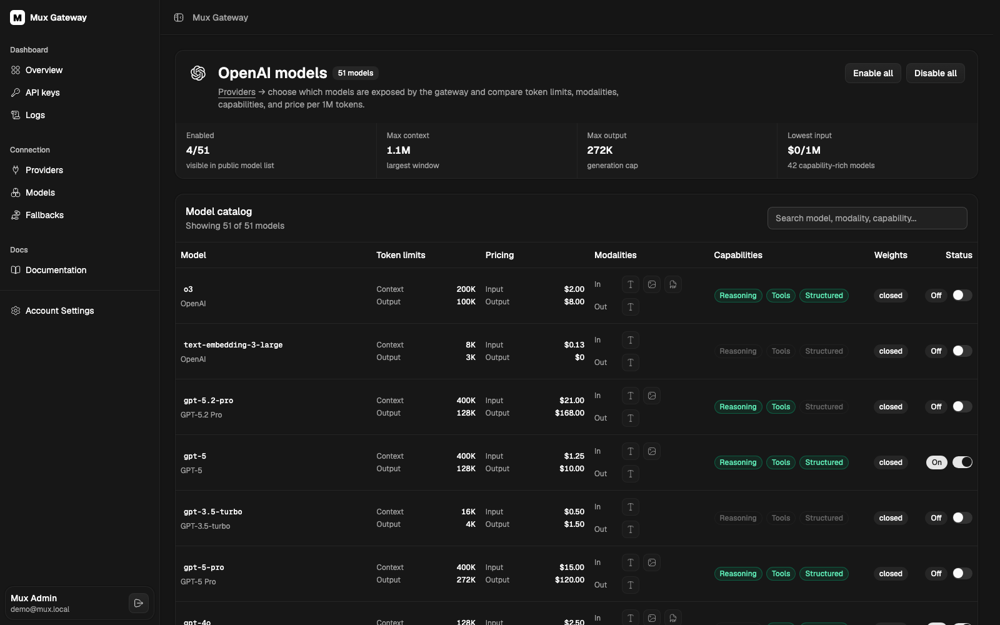

# Mux Gateway

One OpenAI-compatible gateway for every model your team is allowed to use.

Mux gives engineering teams a self-hosted control plane for LLM access. Put provider credentials in one place, expose a curated model catalog, issue internal API keys, route requests through a single OpenAI-shaped endpoint, and see usage, latency, errors, token volume, and estimated cost from the dashboard.

It is built for teams that want provider flexibility without spreading provider keys, model IDs, fallback rules, and request audit trails across every service.



## What Mux Does

- **Unifies model access** behind `/v1/chat/completions` and `/v1/models`.
- **Keeps provider keys centralized** with encrypted-at-rest storage.
- **Controls model exposure** so teams only see the models you enable.
- **Issues gateway API keys** for internal services, with optional USD balances.
- **Tracks every request** with status, latency, token usage, cost, provider, model, and API key.
- **Supports streaming responses** using OpenAI-compatible server-sent events.
- **Creates fallback model IDs** such as `mux:fast-chat` that try ordered provider/model targets.
- **Runs in your infrastructure** with Docker, Postgres, Redis, and Caddy.

## Product Views

### Usage And Request Logs

Monitor request volume, tokens, cost, and provider/model activity from the dashboard. Logs stay searchable and filterable when you need to investigate a specific provider, model, API key, status code, or latency spike.



### Provider Control

Configure provider credentials once. Mux keeps keys encrypted at rest and shows which providers are ready, which still need credentials, and when keys were last updated.



### Curated Model Catalog

Review provider models before exposing them. Compare context windows, output limits, modalities, pricing, capabilities, and weights, then enable only the models your teams should use.



## How Teams Use It

1. Deploy Mux inside your environment.
2. Create the first admin account from the onboarding screen.
3. Add provider keys under **Providers**.
4. Enable the models you want to expose.
5. Create Mux API keys for your services.
6. Point OpenAI-compatible clients at the gateway.

```http
POST /api/v1/chat/completions
Authorization: Bearer mux_live_...
Content-Type: application/json

{
  "model": "openai:gpt-4o",
  "messages": [
    { "role": "user", "content": "Summarize this RFC in three bullets." }
  ],
  "stream": true
}
```

Switch models by changing the provider-qualified model ID, for example `openai:gpt-4o`, `openai:o4-mini`, or a virtual fallback model such as `mux:fast-chat`. Responses remain OpenAI-compatible for streamed and non-streamed requests.

## Why Run Mux

**For platform teams:** keep provider keys out of application repos, centralize model access, and make model availability an operational decision instead of a code change.

**For application teams:** use one OpenAI-compatible API surface while still reaching different upstream providers and models.

**For operators:** answer who called which model, when it happened, how long it took, whether it failed, how many tokens were used, and what it likely cost.

## Quick Start

```sh
cp .env.example .env
docker compose up -d --build
```

Open the dashboard:

```text
http://localhost
```

On a fresh database, Mux redirects to onboarding so you can create the first admin account. After signing in, add a provider key, enable models, and create a gateway API key.

When running through the default Caddy setup, the gateway API is available at:

```text
http://localhost/api
```

## Overhead Benchmark

Mux includes a local CLI benchmark for measuring gateway overhead against direct OpenAI API calls.
It exercises the full default stack through Caddy at `/api/v1`, creates a temporary Mux API key,
and revokes that key when the run finishes.

```sh
OPENAI_API_KEY=sk-... \
MUX_API_KEY=mux_live_... \
pnpm benchmark:overhead
```

Useful options:

```sh
pnpm benchmark:overhead --model gpt-5.4-mini --requests 30 --stream-requests 20 --concurrency 1
```

The command prints a latency table and writes JSON to `benchmark-results/`.
If `MUX_API_KEY` is not set, the benchmark can instead use `MUX_ADMIN_EMAIL` and
`MUX_ADMIN_PASSWORD` to create and revoke a temporary Mux API key.

Recent 100-sample run against `gpt-5.4-mini`:

| Metric | Direct p50 | Mux p50 | Median overhead | Direct p95 | Mux p95 |
| --- | ---: | ---: | ---: | ---: | ---: |
| Non-stream total | 803.79 ms | 765.15 ms | -38.64 ms | 1119.69 ms | 1114.44 ms |
| Stream first chunk | 528.06 ms | 542.85 ms | +14.79 ms | 716.38 ms | 697.74 ms |
| Stream total | 663.33 ms | 662.06 ms | -1.27 ms | 889.91 ms | 861.99 ms |

In this run, Mux added no measurable total-response overhead and about 15 ms median
overhead to the first streamed chunk. Negative overhead values are expected benchmark
variance, not a product claim that the gateway makes upstream models faster.

## Deployment Notes

Mux ships as a small self-hosted stack:

- Gateway API and OpenAI-compatible proxy
- React platform dashboard
- Postgres for users, keys, configuration, and request logs
- Redis for request-log buffering and async primitives
- Caddy reverse proxy for `/api/*` and dashboard traffic

Important production settings:

| Variable | Purpose |
| --- | --- |
| `AUTH_SECRET` | Session signing secret. Change this outside local development. |
| `AUTH_COOKIE_SECURE` | Set to `true` when serving over HTTPS. |
| `PROVIDER_KEYS_ENCRYPTION_KEY` | Encryption material for provider API keys. |
| `CLIENT_ORIGINS` | Browser origins allowed to call the API directly. |
| `VITE_API_URL` | Dashboard API base path. Defaults to `/api` for the Caddy setup. |
| `CADDY_DOMAIN` | Host and port served by Caddy. |
| `MUX_RESPONSES_CACHE` | Set to `1` to enable Redis read-through caching for response retrieval. |
| `MUX_RESPONSES_CACHE_TTL_SECONDS` | TTL for cached response retrieval bodies. Defaults to `300`. |
| `AZURE_OPENAI_RESPONSES_ENDPOINT` | Azure Responses endpoint used by worker polling for Azure background jobs. |
| `BACKGROUND_POLL_WORKER_CONCURRENCY` | Background response poll worker concurrency. Defaults to `5`. |

## Current Boundaries

Mux is intentionally focused. It is not trying to replace every edge-policy or observability system you already run.

It does not currently handle:

- Weighted provider load balancing
- Provider-wide automatic fallback rules
- Embeddings proxying
- Function-call normalization between providers
- Full multi-tenant isolation

For development workflow, contribution notes, and local host-mode commands, see [CONTRIBUTING.md](./CONTRIBUTING.md).
