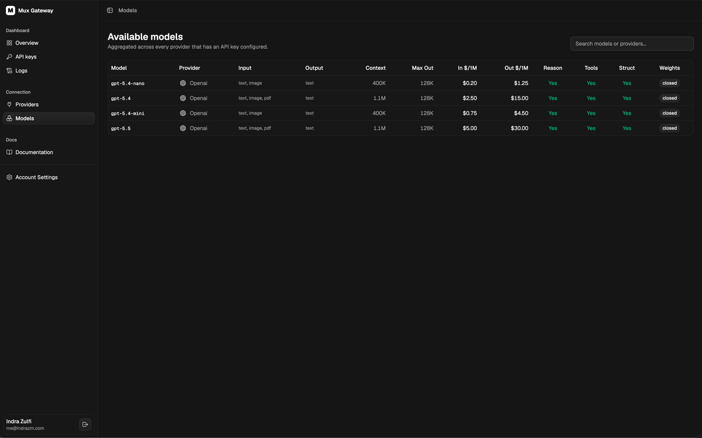

# Mux Gateway

> One OpenAI-compatible endpoint for every model your team uses.

Mux is a self-hosted LLM gateway with a dark, operator-focused dashboard. It gives your services one API surface for OpenAI, Anthropic, Google, Mistral, and other provider catalogs, while keeping provider keys, API keys, request logs, costs, and model availability in one place.

Mux is intentionally small. It is not a policy engine or load balancer. It is a fast gateway for teams that want clean provider management, simple fallback routing, OpenAI-shaped chat completions, streaming support, and enough visibility to answer: who called which model, when, how long did it take, and what did it cost?

## Screenshots

### Provider configuration

Store provider credentials once, keep them encrypted at rest, and see which providers still need keys.


### Admin model catalog

Review provider models, compare context windows and pricing, and decide which models are exposed by the gateway.


### Available models

Users see only the enabled models available through configured providers.



## Why Mux

- **One endpoint.** Point OpenAI-compatible clients at Mux and call `/v1/chat/completions`.
- **Provider freedom.** Configure provider keys centrally and switch models without changing client code.
- **Fallback groups.** Create virtual `mux:<group>` models that try ordered provider/model targets when an upstream call fails.
- **Streaming support.** Stream chat completions as server-sent events with OpenAI-shaped chunks.
- **Request visibility.** Capture provider, model, status, latency, prompt tokens, completion tokens, total tokens, and estimated cost.
- **Encrypted provider keys.** Provider API keys are encrypted with AES-256-GCM and are never shown in full after saving.
- **Admin dashboard.** Manage providers, model exposure, gateway API keys, logs, and account sessions from the platform UI.
- **Self-hosted stack.** Run the gateway, dashboard, Postgres, Redis, and Caddy with Docker Compose.

## What is included

| Surface | Path | Purpose |
| --- | --- | --- |
| Gateway API | `apps/api` | Hono server for auth, provider management, logs, API keys, models, and OpenAI-compatible chat completions. |
| Platform dashboard | `apps/platform` | React, Vite, TanStack Router, and TanStack Query dashboard. |
| Shared UI | `packages/ui` | Shared component library and global styles used by the dashboard. |
| Worker primitives | `packages/worker` | Redis and BullMQ primitives for async jobs. |
| Reverse proxy | `Caddyfile` | Routes `/api/*` to the gateway and everything else to the platform. |

## Quick start

```sh
cp .env.example .env
docker compose up -d --build
```

Open the dashboard:

```text
http://localhost
```

On a fresh database, the platform redirects to onboarding so you can create the first admin account. After signing in, add at least one provider key under **Providers**, then enable the models you want to expose from the provider's model catalog.

When running through Caddy, the public gateway API is available under:

```text
http://localhost/api
```

For local development with the API and platform running directly on the host, see [CONTRIBUTING.md](./CONTRIBUTING.md).

## Use the gateway

Create a Mux API key in the dashboard, then send OpenAI-compatible requests through the gateway.

```http
POST /api/v1/chat/completions
Authorization: Bearer mux_live_...
Content-Type: application/json

{
  "model": "openai:gpt-4o",
  "messages": [
    { "role": "user", "content": "Summarize this RFC in three bullets." }
  ],
  "stream": true
}
```

Swap `openai:gpt-4o` for any enabled `provider:model` id returned by the model list. Admins can also create fallback groups and expose virtual model IDs such as `mux:fast-chat`, which try ordered provider/model targets when an upstream call fails. The response remains OpenAI-compatible for both streamed and non-streamed requests.

List the models exposed by the gateway:

```http
GET /api/v1/models
Authorization: Bearer mux_live_...
```

Only enabled models from configured providers and enabled fallback groups are returned.

## Dashboard areas

- **Overview** - high-level usage, latency, and cost.
- **API keys** - issue and revoke gateway keys for internal services.
- **Logs** - inspect request history with provider, model, status, latency, token usage, and estimated cost.
- **Providers** - add, replace, or remove provider API keys.
- **Models** - browse enabled models across configured providers and virtual fallback groups.
- **Fallbacks** - create virtual `mux:<group>` models with ordered provider/model targets.
- **Provider model catalog** - enable or disable individual models exposed through the gateway.
- **Documentation** - inline API reference for gateway usage.
- **Account Settings** - view account details and manage the current session.

## Environment

The default `.env.example` is enough for local Docker usage. The important settings are:

| Variable | Purpose |
| --- | --- |
| `AUTH_SECRET` | Secret used for authenticated sessions. Change it outside local development. |
| `AUTH_COOKIE_SECURE` | Set to `true` when serving over HTTPS. |
| `PROVIDER_KEYS_ENCRYPTION_KEY` | Encryption material for provider API keys. Use a long secret or a 64-character hex key. |
| `CLIENT_ORIGINS` | Origins allowed by CORS when the API is not only accessed behind Caddy. |
| `VITE_API_URL` | Platform API base path. Defaults to `/api` for the Caddy setup. |
| `CADDY_DOMAIN` | Host and port served by Caddy. Defaults to `localhost:80`. |

## API surface

| Method | Path | Purpose |
| --- | --- | --- |
| `POST` | `/v1/chat/completions` | OpenAI-compatible chat completion, streaming or non-streaming. |
| `GET` | `/v1/models` | List models currently exposed by the gateway. |
| `POST` | `/auth/onboard` | Create the first admin user on a fresh install. |
| `POST` | `/auth/login` | Email/password dashboard login. |
| `POST` | `/auth/logout` | End the current dashboard session. |
| `GET` | `/api-keys` | List gateway API keys. |
| `POST` | `/api-keys` | Create a gateway API key. |
| `DELETE` | `/api-keys/:id` | Revoke a gateway API key. |
| `GET` | `/logs` | Browse request logs. |
| `GET` | `/logs/stats` | Aggregate request, token, latency, and cost statistics. |
| `GET` | `/fallback-groups` | List configured fallback groups. |
| `POST` | `/fallback-groups` | Create a fallback group. |
| `PUT` | `/fallback-groups/:id` | Update a fallback group. |
| `DELETE` | `/fallback-groups/:id` | Delete a fallback group. |
| `GET` | `/providers` | List provider catalog and configured key status. |
| `GET` | `/models` | List enabled models available to users. |
| `GET` | `/health` | Gateway health check. |

When using the Docker Compose Caddy setup, prefix API paths with `/api`, for example `/api/v1/models`. Caddy strips that prefix before forwarding to the gateway.

## Roles

- **Admin** - manage providers, model exposure, API keys, users, logs, and account settings.
- **User** - browse available models, inspect logs, and manage their own session.

## Deliberate non-goals

Mux stays focused by leaving these concerns to your edge layer or application code:

- Weighted load balancing across providers
- Provider-wide fallback rules
- Budget enforcement and rate limiting
- Embeddings proxying
- Function-call normalization between providers
- Multi-tenant isolation

## Development

Common commands:

```sh
pnpm install
pnpm --filter @repo/api dev
pnpm --filter @repo/platform dev
pnpm typecheck
pnpm check
```

Additional setup, contribution workflow, and database notes live in [CONTRIBUTING.md](./CONTRIBUTING.md).
